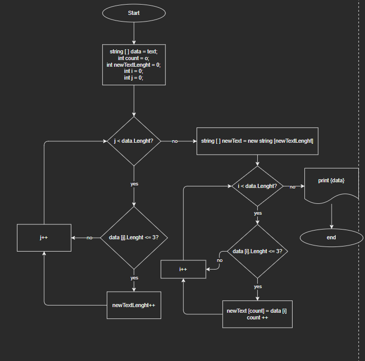
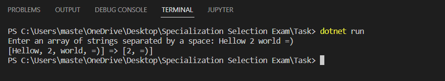

## Условия задачи

 *Написать программу, которая из имеющегося массива строк формирует новый массив из строк, длина которых меньше, либо равна 3 символам. Первоначальный массив можно ввести с клавиатуры, либо задать на старте выполнения алгоритма. При решении не рекомендуется пользоваться коллекциями, лучше обойтись исключительно массивами.*

### Примеры:
* [“Hello”, “2”, “world”, “:-)”] → [“2”, “:-)”]
* [“1234”, “1567”, “-2”, “computer science”] → [“-2”]
* [“Russia”, “Denmark”, “Kazan”] → []

## Блок - Схема к Задаче


## Решение.

**Решение задачи можно разбить на три блока.**
1. Блок: 
* пользовательский ввод строки, инициализация переменной и присвоение ей значения, полученного после ввода:
```
Console.Write("Enter an array of strings separated by a space: ");
string text = Console.ReadLine();
```
* инициализация массива и запись в него имеющейся строки/строк:
```
string[] data = text.Split(' ');
```
2. Блок:
* Создаем метод, принимающий в качестве аргумента массив строк, для поиска элементов, состоящих из трех или менее символов:
```
string[] CheckElemLenght(string[] arr)
```
* Внутри метода выполняем поск количества подходящих элементов во входящем массиве, для инициализации размера нового массива, куда будут записаны эти элементы:
```
int newTextLenght = 0;
    for (int j = 0; j < arr.Length; j++)
    {
        if (arr[j].Length <= 3) newTextLenght++;
    }
```
* Далее внутри метода инициализируем новый массив и записываем туда все элементы, удовлетворяющие условию, из входящего массива:
```
int count = 0;
string[] newText = new string[newTextLenght];

    for (int i = 0; i < arr.Length; i++)
    {
        if (arr[i].Length <= 3)
        {
            newText[count] = arr[i];
            count++;
        }
        else continue;
    }
```
* Метод возвращает новый массив, заполненный строками, состоящими из трех и менее символов:
```
return newText;
```
* Создаем переменную result, применяем метод к входящему массиву, и записываем результат в переменную:
```
string[] result = CheckElemLenght(data);
```
3. Блок:
* Для вывода входящего массива и массива с решением, создаем метод печати массива:
```
void PrintArray(string[] array)
{
    Console.Write("[");
    for (int i = 0; i < array.Length; i++)
    {        
        if (i < array.Length - 1) Console.Write($"{array[i]}, ");
    }
    Console.Write(array[array.Length - 1]);
    Console.Write("]");
}
```
* Применяем метод к входящему массиву и результирующему для вывода в консоль:
```
PrintArray(data);
Console.Write(" => ");
PrintArray(result);
```
## Результат работы программы:

